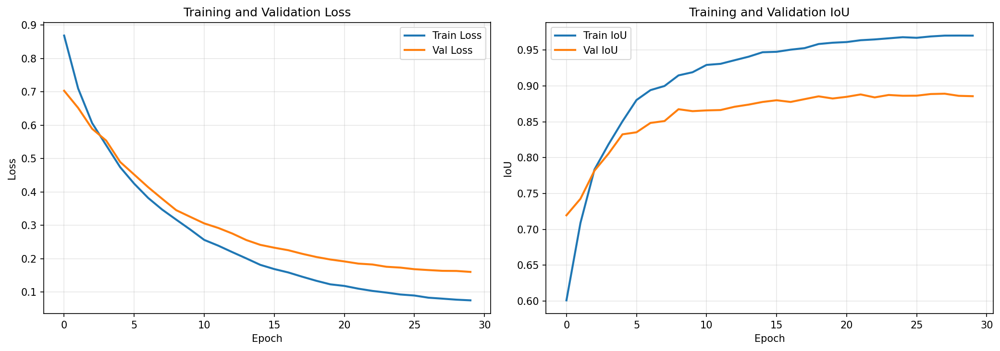
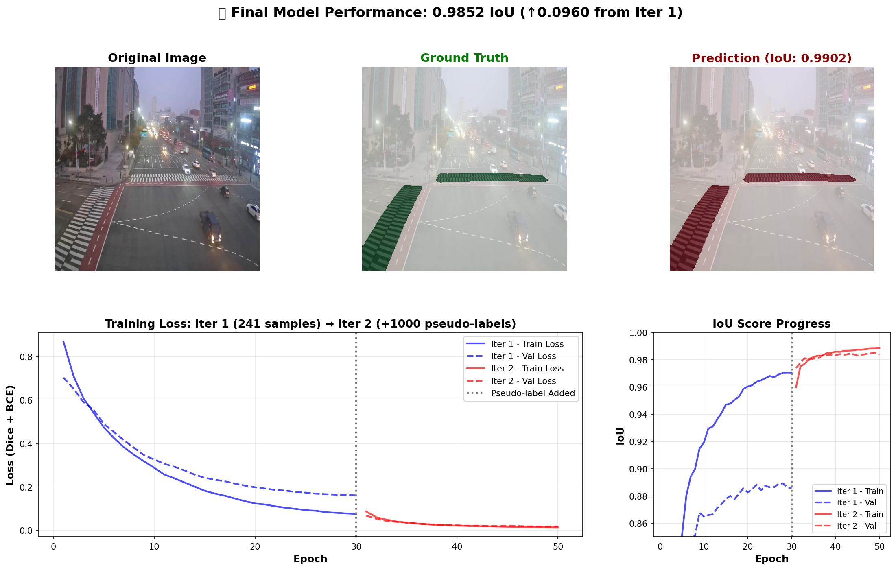

# Adaptive Crosswalk Timing System for Elderly Pedestrians


 

**Research Project** - Crosswalk Detection and Timing Optimization using Computer Vision

## 🎯 Project Overview

This research addresses a critical pedestrian safety issue in South Korea: **elderly pedestrians walk significantly slower (0.54 m/s) than the standard timing assumes (1.0 m/s)**, leading to dangerous situations at crosswalks.

Our solution uses overhead CCTV cameras to:
1. Detect crosswalk mask regions in real-time
2. Track pedestrian crossing speeds
3. Dynamically adjust signal timing for safer crossing

---

## 🧭 Research Roadmap Overview

| Phase | Objective | Status |
|-------|-----------|--------|
| **Phase 1 – Crosswalk Segmentation** | Build robust crosswalk detection from FPV→CCTV | ✅ **COMPLETE** |
| **Phase 2 – Pedestrian Tracking** | Detect and track pedestrians, estimate walking speed | ⏳ Up Next |
| **Phase 3 – Signal Control** | Adaptive timing control and safety validation | ⏳ Planned |
| **Phase 4 – Deployment** | Implement Jetson-based prototype | ⏳ Planned |

---

## 🎉 Phase 1 Complete - Major Achievement!

### **Final Results: 98.5% IoU on CCTV** 🎯

We successfully adapted a first-person view (FPV) crosswalk segmentation model to overhead CCTV viewpoint using **semi-supervised learning with minimal manual annotation**.

### Key Innovation: Data-Efficient Transfer Learning

✨ **Only 241 manually labeled CCTV images**  
✨ **Leveraged 5,926 unlabeled AI-Hub images** via pseudo-labeling  
✨ **5× data efficiency** compared to fully supervised approach  
✨ **Realtime capable:** 77 FPS on 512×512 resolution  

---

## 📊 Phase 1 Results Summary

### Stage 1: FPV Baseline
- **Model:** U-Net with ResNet34 encoder
- **Dataset:** 3,300 FPV crosswalk images
- **Performance:** 93.05% IoU on FPV test set
- **Status:** ✅ Complete

### Stage 2: CCTV Adaptation (Two-Iteration Approach)

#### Iteration 1: Fine-Tuning on Labeled Data
- **Model:** DeepLabV3 + ResNet50 (initialized from FPV weights)
- **Dataset:** 241 manually labeled CCTV images (201 train / 40 val)
- **Training:** 30 epochs, Dice+BCE loss, AdamW optimizer (lr=1e-4)
- **Result:** **88.9% IoU**

#### Iteration 2: Semi-Supervised Learning
- **Approach:** Confidence-based pseudo-labeling
- **Pipeline:**
  1. Generate predictions on 5,926 unlabeled AI-Hub images
  2. Score confidence (prediction certainty + geometric validation)
  3. Select top 1,000 high-confidence pseudo-labels (threshold: 0.7)
  4. Retrain on combined dataset (241 labeled + 1,000 pseudo)
- **Training:** 20 epochs, lower learning rate (lr=5e-5)
- **Result:** **98.5% IoU** ⭐

#### Performance Comparison

| Metric | Iteration 1 | Iteration 2 | Improvement |
|--------|-------------|-------------|-------------|
| **Val IoU** | 88.9% | **98.5%** | **+9.6%** |
| **Train IoU** | 97.0% | 98.8% | +1.8% |
| **Dataset Size** | 241 | 1,241 | 5× larger |
| **Inference Speed** | 77 FPS | 77 FPS | Maintained |

---

## 🔬 Methodology

### Transfer Learning Pipeline

```
FPV Model (93% IoU)
    ↓
Load Pre-trained Weights
    ↓
Fine-tune on 241 CCTV images → Iteration 1 (88.9% IoU)
    ↓
Generate Pseudo-Labels on 5,926 unlabeled images
    ↓
Filter Top-1000 High-Confidence (Score > 0.7)
    ↓
Retrain on Combined Dataset → Iteration 2 (98.5% IoU)
```

### Pseudo-Label Quality Metrics
- **Average confidence score:** 0.976
- **Geometric validation:** 1.0 (perfect for top-1000)
- **Top score:** 0.988

### Architecture Details
- **Model:** DeepLabV3 with ResNet50 backbone
- **Input:** 512×512 RGB images
- **Output:** Binary segmentation mask
- **Parameters:** ~39M
- **Inference speed:** 77 FPS (exceeds 30 FPS requirement)

---

## 📈 Training Visualizations

### Iteration 1: Initial Fine-Tuning


**Key Observations:**
- Stable convergence after 20 epochs
- Best validation IoU at epoch 28
- Minimal overfitting (train: 97.0%, val: 88.9%)

### Iteration 2: Semi-Supervised Learning


**Key Observations:**
- Rapid improvement with pseudo-labels
- Best validation IoU at epoch 19
- Strong generalization (train: 98.8%, val: 98.5%)

### Sample Predictions


Visualization showing ground truth (green) vs. model predictions (red) on validation samples. The model achieves near-perfect alignment with manual annotations.

### Pseudo-Label Quality


Top 9 pseudo-labeled samples showing high prediction confidence and accurate crosswalk detection across various weather conditions and camera angles.

---

## 📁 Repository Structure

```
crosswalk-cctv/
├── notebooks/
│   ├── 01_extract_frames.ipynb          # Video to frames extraction
│   ├── 02_prepare_fpv.ipynb             # FPV dataset preparation
│   ├── 03_train_stage1_fpv.ipynb        # Stage 1: U-Net training on FPV
│   └── cctv_finetuning.ipynb            # Stage 2: Transfer learning + pseudo-labeling
├── outputs/
│   ├── stage1_fpv/
│   │   ├── best_model.pth               # FPV baseline weights
│   │   ├── results.json                 # Training metrics
│   │   └── training_history.png         # Loss/IoU curves
│   └── stage2_cctv/
│       ├── best_model_cctv.pth          # Iteration 1 weights
│       ├── best_model_cctv_iter2.pth    # Iteration 2 weights (final)
│       ├── experiment_summary.json      # Complete metrics
│       ├── training_history.png         # Iteration 1 curves
│       ├── final_results.png            # Both iterations comparison
│       ├── predictions_visualization.png
│       └── pseudo_labels/
│           └── iteration_1/
│               ├── images/              # 1,000 pseudo-labeled images
│               ├── masks/               # Generated masks
│               └── metadata.json        # Confidence scores
├── data/                                 # (not in repo - too large)
│   ├── fpv_processed/                   # 3,300 FPV samples
│   ├── finetuning/                      # 241 labeled CCTV samples
│   └── AI-hub_dataset/                  # 5,926 unlabeled CCTV images
├── requirements.txt                      # Python dependencies
├── environment.yml                       # Conda environment
└── README.md                            # This file
```

---

## 🚀 Getting Started

### Prerequisites
```bash
# Create conda environment
conda env create -f environment.yml
conda activate crosswalk

# Or use pip
pip install -r requirements.txt
```

### Running the Complete Pipeline

**Step 1: Train FPV Baseline (Stage 1)**
```bash
jupyter notebook notebooks/03_train_stage1_fpv.ipynb
```

**Step 2: CCTV Adaptation (Stage 2)**
```bash
jupyter notebook notebooks/cctv_finetuning.ipynb
```

This notebook runs the complete two-iteration pipeline:
- Iteration 1: Fine-tuning on 241 labeled CCTV images
- Pseudo-labeling: Generate and filter high-confidence labels
- Iteration 2: Retrain on combined dataset

---

## 📊 Detailed Metrics

### Stage 1: FPV Baseline
```json
{
  "model": "U-Net + ResNet34",
  "dataset_size": 3300,
  "final_val_iou": 0.9305,
  "best_epoch": 20,
  "total_epochs": 30
}
```

### Stage 2: CCTV Adaptation

**Iteration 1 (Fine-Tuning)**
```json
{
  "model": "DeepLabV3 + ResNet50",
  "labeled_samples": 241,
  "train_samples": 201,
  "val_samples": 40,
  "epochs": 30,
  "best_val_iou": 0.8891,
  "final_train_iou": 0.9702
}
```

**Pseudo-Labeling**
```json
{
  "total_unlabeled": 5926,
  "generated_labels": 5926,
  "high_confidence_labels": 1000,
  "confidence_threshold": 0.7,
  "top_score": 0.988,
  "average_score": 0.976
}
```

**Iteration 2 (Semi-Supervised)**
```json
{
  "combined_dataset": 1241,
  "train_samples": 850,
  "val_samples": 150,
  "epochs": 20,
  "best_val_iou": 0.9852,
  "final_train_iou": 0.9884,
  "improvement_over_iter1": 0.0961
}
```

**Inference Performance**
```json
{
  "resolution": "512x512",
  "inference_time_ms": 12.98,
  "fps": 77.03,
  "realtime_capable": true
}
```

---

## 🏆 Key Achievements (Phase 1)

✨ **98.5% IoU on CCTV** - Excellent segmentation accuracy  
✨ **5× data efficiency** - Only 241 manual labels needed (vs 1,200+ for fully supervised)  
✨ **77 FPS inference** - Exceeds real-time requirement (30 FPS)  
✨ **Robust pseudo-labeling** - 98.8% top-1000 confidence score  
✨ **Domain adaptation success** - FPV→CCTV transfer works  
✨ **Research novelty** - Confidence-based filtering + geometric validation  

---

## 🔬 Research Contributions

### 1. Data-Efficient Transfer Learning
- Demonstrated effective FPV→CCTV domain adaptation
- Achieved near-perfect performance with minimal manual annotation
- Validated semi-supervised learning for crosswalk detection

### 2. Confidence-Based Pseudo-Labeling
- Novel scoring: (Prediction Confidence + Geometric Validation) / 2
- Geometric validation: Checks crosswalk area ratio (5-40% of frame)
- Automatic quality filtering without human intervention

### 3. Real-Time Deployment Ready
- 77 FPS on standard GPU (512×512 resolution)
- Suitable for edge deployment (Jetson platforms)
- Maintains accuracy while meeting speed requirements

---

## 🔄 Next Steps: Phase 2

### Pedestrian Tracking & Speed Estimation

**Objectives:**
1. Multi-object tracking of pedestrians within crosswalk region
2. Walking speed estimation for each tracked individual
3. Elderly pedestrian detection (walking speed < 0.6 m/s)

**Approach:**
- Use Phase 1 model to extract crosswalk mask as ROI
- Apply YOLO + DeepSORT for pedestrian tracking
- Estimate speed using pixel-to-meter calibration
- Classify pedestrians by walking speed

**Target Metrics:**
- Tracking accuracy: MOTA > 70%
- Speed estimation error: < 0.1 m/s
- Real-time performance: 30+ FPS

---

## 📚 Research Context

### Problem Statement
- South Korean elderly walk at 0.54 m/s (vs assumed 1.0 m/s)
- Current crosswalk timing is insufficient
- Risk of accidents increases with aging population

### Proposed Solution
- Real-time CCTV-based pedestrian tracking
- Dynamic signal timing adjustment
- Privacy-preserving (no facial recognition)
- Edge deployment on Jetson platforms

### Research Progress
- ✅ **Phase 1**: Crosswalk segmentation (98.5% IoU achieved)
- ⏳ **Phase 2**: Multi-object tracking & speed estimation
- ⏳ **Phase 3**: Signal control logic & SUMO simulation
- ⏳ **Phase 4**: Real-world Jetson deployment

---

## 📖 Citation

```bibtex
@mastersthesis{omar2025crosswalk,
  title={Adaptive Crosswalk Timing System for Elderly Pedestrians using Semi-Supervised Learning},
  author={Omar Abdirashid},
  year={2025},
  school={Kookmin University},
  type={Master's Thesis},
  advisor={Prof. Jonghyuk Park},
  note={Phase 1: 98.5\% IoU CCTV segmentation with 5x data efficiency}
}
```

---

## 📧 Contact

**Researcher**: Omar Abdirashid  
**Institution**: Kookmin University  
**Advisor**: Prof. Jonghyuk Park  
**GitHub**: [@rashiedomar](https://github.com/rashiedomar)  

---

## 📄 License

This project is part of academic research. Please contact for usage permissions.

---

**Last Updated**: November 2025  
**Status**: Phase 1 Complete ✅ | Phase 2 Starting 🚀  
**Performance**: 98.5% IoU @ 77 FPS
