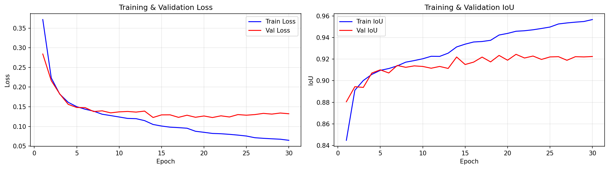
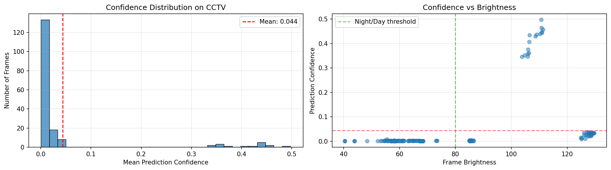
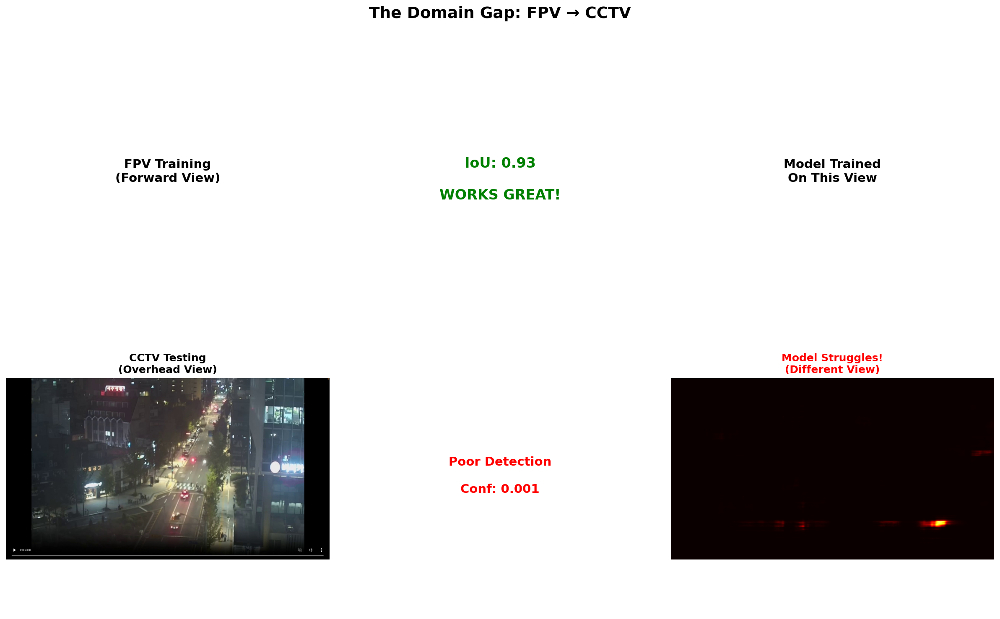
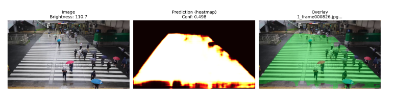
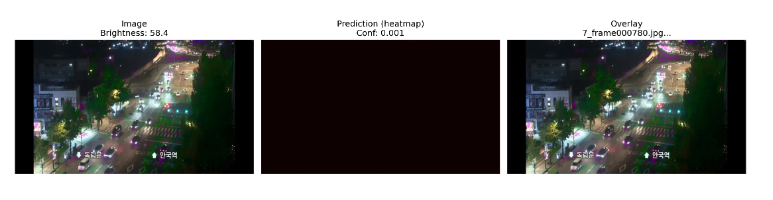
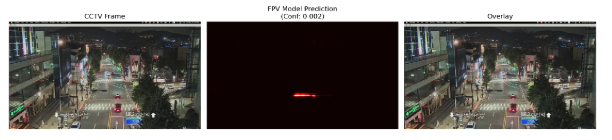
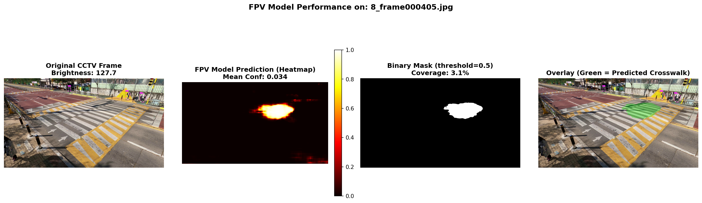

# Adaptive Crosswalk Timing System for Elderly Pedestrians

> **Graduation Research Project** - Crosswalk Detection and Timing Optimization using Computer Vision

## 🎯 Project Overview

This research addresses a critical pedestrian safety issue in South Korea: **elderly pedestrians walk significantly slower (0.54 m/s) than the standard timing assumes (1.0 m/s)**, leading to dangerous situations at crosswalks.

Our solution uses overhead CCTV cameras to:
1. Detect crosswalk mask regions in real-time
2. Track pedestrian crossing speeds
3. Dynamically adjust signal timing for safer crossing

---

## 🧭 Research Roadmap Overview

| Phase | Objective | Stages | Status |
|-------|-----------|--------|--------|
| **Phase 1 – Crosswalk Segmentation & Adaptation** | Build robust crosswalk masking from FPV→CCTV | ① FPV baseline (✅ done)<br>② Geometric adaptation (🔄)<br>③ Cross-view validation (⏳) | **In progress** |
| **Phase 2 – Pedestrian Tracking & Speed Estimation** | Detect and track pedestrians, estimate walking speed | TBD | ⏳ |
| **Phase 3 – Signal Control & SUMO Simulation** | Adaptive timing control and safety validation | TBD | ⏳ |
| **Phase 4 – Real-World Deployment** | Implement Jetson-based prototype | TBD | ⏳ |

---

## 📊 Phase 1 – Stage 1 ✅

### Goal
Train a crosswalk segmentation model on front-view pedestrian (FPV) data and test it on overhead CCTV footage to **prove the domain gap exists**.

### Results Summary

| Metric | FPV Dataset | CCTV Dataset | Gap |
|--------|-------------|--------------|-----|
| **IoU** | **93.05%** | N/A | - |
| **Average Confidence** | High | **4.4%** | **-88.6%** |
| **Dataset Size** | 3,300 frames | 175 frames | - |

### Key Findings

✅ **Successfully trained** U-Net model on FPV crosswalk images  
✅ **Achieved 93% IoU** on FPV test set (excellent performance)  
✅ **Proved massive domain gap**: Model fails on CCTV (4.4% confidence)  
✅ **Validated research direction**: Geometric adaptation is necessary

---

## 📈 Training Performance

### Training Dataset Samples


Examples from the FPV crosswalk dataset used for training. Each sample includes the original image, ground truth mask, and overlay visualization.

### Training Progress


**Training Details:**
- Architecture: U-Net with ResNet34 encoder
- Dataset: 3,300 FPV crosswalk images
- Training epochs: 30
- Best performance: Epoch 20-25
- Final validation IoU: 93.05%

### Model Predictions on FPV Test Set


The model achieves excellent segmentation on FPV (front-view) images, accurately predicting crosswalk masks with 93% IoU.

---

## 🔍 Domain Gap Visualization

### Confidence Analysis


The model shows extremely low confidence (4.4% average) when tested on CCTV footage, demonstrating the significant viewpoint and illumination differences.

### Domain Gap Comparison


Clear visualization of performance difference between FPV (car camera) and overhead CCTV viewpoints.

### Sample Predictions

**Best CCTV Predictions:**


**Worst CCTV Predictions:**


**Random Samples:**


### Specific Case Analysis


---

## 📁 Repository Structure

```
crosswalk-cctv/
├── notebooks/
│   ├── 01_extract_frames.ipynb          # Video to frames extraction
│   ├── 02_prepare_fpv.ipynb             # FPV dataset preparation
│   ├── 03_visualize_fpv_vs_cctv.ipynb   # Domain comparison
│   ├── 04_train_stage1_fpv.ipynb        # Phase 1 - Stage 1: U-Net training
│   └── 05_test_fpv_on_cctv.ipynb        # Phase 1 - Stage 1: CCTV evaluation
├── outputs/
│   ├── stage1_fpv/
│   │   ├── results.json                 # Training metrics
│   │   └── training_history.png         # Loss/IoU curves
│   └── stage1_test_on_cctv/
│       ├── cctv_test_results.json       # CCTV evaluation metrics
│       └── *.png                        # Visualization outputs
├── data/                                 # (not in repo - too large)
│   ├── fpv_processed/                   # 3,300 FPV samples
│   ├── cctv_frames/                     # 175 CCTV samples
│   └── FPVCrosswalk2025/                # Original FPV dataset
├── requirements.txt                      # Python dependencies
├── environment.yml                       # Conda environment
└── README.md                            # This file
```

---

## 🚀 Getting Started

### Prerequisites
```bash
# Create conda environment
conda env create -f environment.yml
conda activate crosswalk

# Or use pip
pip install -r requirements.txt
```

### Running the Pipeline (Phase 1 - Stage 1)

**Step 1: Data Preparation**
```bash
# Extract frames from videos
jupyter notebook notebooks/01_extract_frames.ipynb

# Prepare FPV dataset
jupyter notebook notebooks/02_prepare_fpv.ipynb

# Compare FPV vs CCTV domains
jupyter notebook notebooks/03_visualize_fpv_vs_cctv.ipynb
```

**Step 2: Training (Stage 1)**
```bash
# Train U-Net on FPV data
jupyter notebook notebooks/04_train_stage1_fpv.ipynb
```

**Step 3: Evaluation (Stage 1)**
```bash
# Test on CCTV footage to quantify domain gap
jupyter notebook notebooks/05_test_fpv_on_cctv.ipynb
```

---

## 📊 Detailed Metrics

### FPV Training Results
```json
{
  "final_train_loss": 0.0650,
  "final_train_iou": 0.9568,
  "final_val_loss": 0.1320,
  "final_val_iou": 0.9305,
  "best_epoch": 20,
  "total_epochs": 30,
  "dataset_size": 3300
}
```

### CCTV Test Results
```json
{
  "average_confidence": 0.044,
  "max_confidence": 0.408,
  "min_confidence": 0.002,
  "num_test_frames": 175,
  "night_frames_percentage": 73.7,
  "domain_gap": "SEVERE - Model fails on CCTV"
}
```

---

## 🔄 Phase 1 – Stage 2 (In Progress)

### Objective
Develop **geometry-guided domain adaptation** to transfer the FPV-trained model to CCTV viewpoint **without manual CCTV labels**.

### Approach
1. **Zebra Stripe Detection**: Use geometric patterns for auto-calibration
2. **Homography Estimation**: Map FPV viewpoint → CCTV viewpoint
3. **Geometric Supervision**: Use zebra stripes as pseudo-labels
4. **Fine-tune Model**: Adapt to overhead view using geometry alone

### Target Performance
- CCTV IoU: **65-75%** (without manual labels)
- Compare with fully supervised baseline: ~85% IoU (requires 400+ labels)
- **Novel Contribution**: 8× fewer labels needed through geometric adaptation

---

## ⏳ Phase 1 – Stage 3 (Upcoming)

### Objective
Validate adapted model on larger CCTV test sets across diverse conditions.

### Validation Plan
- Test on multiple CCTV cameras (different angles, heights)
- Evaluate day vs. night performance
- Quantify IoU, confidence, and geometric accuracy
- Compare with fully supervised baseline

### Success Criteria
- Consistent 65%+ IoU across different CCTV viewpoints
- Robust performance in day/night conditions
- Geometric alignment accuracy within acceptable threshold

---

## 📚 Research Context

### Problem Statement
- South Korean elderly walk at 0.54 m/s (vs assumed 1.0 m/s)
- Current crosswalk timing is insufficient
- Risk of accidents increases with aging population

### Proposed Solution
- Real-time CCTV-based pedestrian tracking
- Dynamic signal timing adjustment
- Privacy-preserving (no facial recognition)
- Edge deployment on Jetson platforms

### Research Phases & Current Progress
- ✅ **Phase 1 - Stage 1**: FPV baseline segmentation (93% IoU achieved)
- 🔄 **Phase 1 - Stage 2**: Geometric domain adaptation (in progress)
- ⏳ **Phase 1 - Stage 3**: Cross-view CCTV validation (up next)
- ⏳ **Phase 2**: Multi-object tracking & speed estimation
- ⏳ **Phase 3**: Signal control logic & SUMO simulation
- ⏳ **Phase 4**: Real-world Jetson deployment

---

## 🏆 Key Achievements (Phase 1 - Stage 1)

✨ **High-quality FPV model**: 93% IoU on crosswalk segmentation  
✨ **Proven domain gap**: Quantified the FPV→CCTV challenge (88.6% drop)  
✨ **Clear visualizations**: Documented failure modes and domain shift  
✨ **Research validation**: Justified need for geometric adaptation  
✨ **Reproducible pipeline**: End-to-end notebooks provided  

---

## 📖 Citation

```bibtex
@mastersthesis{omar2025crosswalk,
  title={Adaptive Crosswalk Timing System for Elderly Pedestrians using Geometric Domain Adaptation},
  author={Omar Abdirashid},
  year={2025},
  school={[Your University]},
  type={Master's Thesis},
  advisor={Prof. Jonghyuk Park}
}
```

---

## 📧 Contact

**Researcher**: Omar Abdirashid 
**GitHub**: [@rashiedomar](https://github.com/rashiedomar)  
**Project**: Graduation Research - Adaptive Crosswalk System

---

## 📄 License

This project is part of academic research. Please contact for usage permissions.

---

**Last Updated**: October 2025  
**Status**: Phase 1 - Stage 1 Complete ✅ | Stage 2 In Progress 🔄